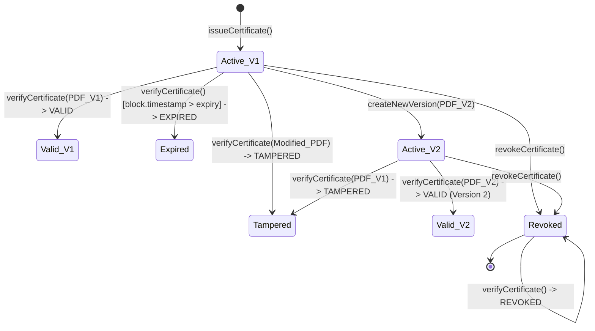
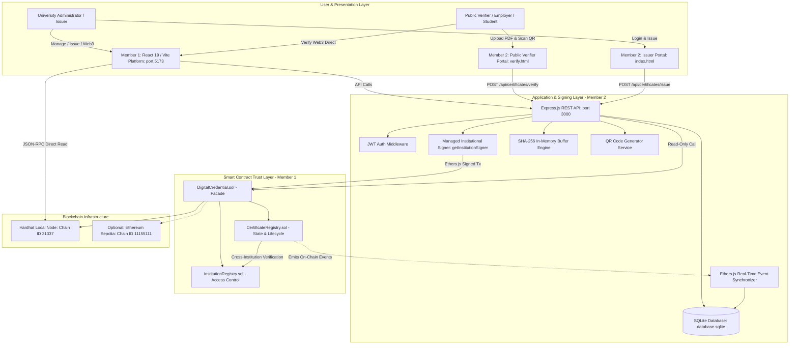

# CredChain
### Hybrid Blockchain-Backed Digital Credential Verification & Lifecycle Management System


**CredChain** is a hybrid blockchain-backed digital credential verification and lifecycle management system. It combines the cryptographic immutability and decentralized access control of Ethereum smart contracts (Solidity `^0.8.20`) with an Express.js backend application layer, an off-chain SQLite store, and modern web interfaces (React 19 / Vite administrative platform and zero-friction public verification portals).

By processing certificate PDF documents in memory to compute deterministic SHA-256 cryptographic digests, CredChain establishes tamper-evident proofs on-chain while keeping student Personally Identifiable Information (PII) private and strictly off-chain.

---

## Table of Contents
1. [Executive Overview](#1-executive-overview)
2. [Problem Statement](#2-problem-statement)
3. [Proposed Solution & Core Concept](#3-proposed-solution--core-concept)
4. [Why Blockchain Is Used](#4-why-blockchain-is-used)
5. [Key System Features](#5-key-system-features)
6. [Complete Credential Lifecycle](#6-complete-credential-lifecycle)
7. [System Architecture](#7-system-architecture)
8. [Two-Member Project Structure](#8-two-member-project-structure)
9. [Repository Structure](#9-repository-structure)
10. [Smart Contract Architecture (Member 1)](#10-smart-contract-architecture-member-1)
11. [On-Chain vs Off-Chain Data Architecture](#11-on-chain-vs-off-chain-data-architecture)
12. [Certificate Hashing & Integrity Verification](#12-certificate-hashing--integrity-verification)
13. [Issuance Flow](#13-issuance-flow)
14. [Verification Flow](#14-verification-flow)
15. [QR Code Verification](#15-qr-code-verification)
16. [Revocation, Expiration & Versioning](#16-revocation-expiration--versioning)
17. [Institution & Issuer Authorization Model](#17-institution--issuer-authorization-model)
18. [Managed Institutional Blockchain Signing](#18-managed-institutional-blockchain-signing)
19. [Backend Architecture (Member 2)](#19-backend-architecture-member-2)
20. [Frontend Platforms (Member 1 & Member 2)](#20-frontend-platforms-member-1--member-2)
21. [Database Schema & Event Indexer](#21-database-schema--event-indexer)
22. [Unified Audit Trail & Telemetry](#22-unified-audit-trail--telemetry)
23. [Analytics Engine](#23-analytics-engine)
24. [REST API Reference](#24-rest-api-reference)
25. [Security Threat Model & Defenses](#25-security-threat-model--defenses)
26. [Network Configuration (Hardhat & Sepolia)](#26-network-configuration-hardhat--sepolia)
27. [Canonical Institutions & Test Fixture Model](#27-canonical-institutions--test-fixture-model)
28. [Installation & Setup](#28-installation--setup)
29. [Environment Variables](#29-environment-variables)
30. [Testing & Validation](#30-testing--validation)
31. [Step-by-Step Demonstration Flow](#31-step-by-step-demonstration-flow)
32. [Limitations & Deployment Notes](#32-limitations--deployment-notes)
33. [Future Scope](#33-future-scope)
34. [Technical Viva Q&A Guide](#34-technical-viva-qa-guide)
35. [Blockchain Guarantees vs Non-Guarantees](#35-blockchain-guarantees-vs-non-guarantees)
36. [Technology Stack](#36-technology-stack)
37. [License & Project Team](#37-license--project-team)

---

## 1. Executive Overview

Credential verification in academic, governmental, and corporate ecosystems faces severe challenges: widespread document forgery, fraudulent diploma mills, slow manual background checks, and fragile centralized databases susceptible to unilateral modification or data loss.

CredChain addresses these vulnerabilities through a **hybrid on-chain/off-chain trust architecture**:
* **On-Chain (Blockchain Trust Anchor):** Stores cryptographic SHA-256 document digests, unique certificate identifiers, authorized institutional issuer wallet addresses, timestamp metadata, version sequences, and immutable revocation flags. **Complete certificate PDF files and student PII are NEVER stored on the blockchain.**
* **Off-Chain (Application & Privacy Layer):** Handles in-memory PDF parsing, student metadata storage, JWT-authenticated administrative workflows, zero-wallet public verifier interfaces, QR code generation, real-time blockchain event synchronization, and verification telemetry audit logging.

```
┌─────────────────────────────────────────────────────────────────────────┐
│                       HYBRID TRUST & DATA MODEL                         │
│                                                                         │
│   ON-CHAIN (Ethereum / EVM)          OFF-CHAIN (SQLite / Express)       │
│   ┌───────────────────────────┐      ┌──────────────────────────────┐   │
│   │ • SHA-256 Document Hash   │      │ • Student Full Name (PII)    │   │
│   │ • Unique Certificate ID   │      │ • Course / Qualification     │   │
│   │ • Issuer Wallet Address   │      │ • Issue Date                 │   │
│   │ • Institution ID Binding  │      │ • Verification Audit Logs    │   │
│   │ • Version History Tree    │      │   (Timestamp, IP, Result)    │   │
│   │ • Revocation State        │      │ • Transient PDF Buffer (RAM) │   │
│   │ • Expiration Timestamp    │      │ • Synchronized Event Cache   │   │
│   └───────────────────────────┘      └──────────────────────────────┘   │
└─────────────────────────────────────────────────────────────────────────┘
```

---

## 2. Problem Statement

1. **Document Forgery & Modification:** Digital PDFs can be altered in seconds using desktop PDF editors. Changing a graduate's name, GPA, degree classification, or issuance date is impossible to catch through visual inspection alone.
2. **Centralized Database Vulnerabilities:** Traditional verification portals store credentials in centralized relational databases. These represent single points of failure vulnerable to SQL injection, administrative tampering, rogue database administrators, and infrastructure outages.
3. **Cross-Institutional Insecurity:** In multi-tenant verification systems, a lack of cryptographic boundaries can allow an authorized user from University B to modify or revoke credentials belonging to University A.
4. **Historical Version Ambiguity:** When an academic transcript is legitimately revised (e.g., grade revisions or legal name corrections), centralized systems often overwrite records, destroying the audit trail of past legitimate versions.
5. **Verification Friction:** Most decentralized Web3 systems require employers and background verifiers to install browser wallet extensions (such as MetaMask), hold cryptocurrency, and pay gas fees simply to verify a document.

---

## 3. Proposed Solution & Core Concept

CredChain implements a complete digital credential lifecycle with zero verification friction:

> **Core Philosophy:** *“We are not putting certificates on a blockchain. We are building a trusted lifecycle for digital credentials, with blockchain serving as the trust layer.”*

```
[ Issuer Login ] ➔ [ Input Details / Upload PDF ] ➔ [ Compute In-Memory SHA-256 ]
        │
        ▼
[ Record On-Chain Hash via Smart Contract ] ➔ [ Cache Off-Chain Metadata in SQLite ]
        │
        ▼
[ Generate Zero-PII QR Code ] ➔ [ Deliver Cryptographic PDF to Graduate ]
        │
        ▼
[ Public Verifier Scans QR / Uploads PDF ] ➔ [ Compute Hash & Query Smart Contract ]
        │
        ▼
[ Return Deterministic Status: VALID | TAMPERED | REVOKED | EXPIRED | NOT_FOUND ]
        │
        ▼
[ Record Verification Telemetry in Off-Chain Audit Log ]
```

---

## 4. Why Blockchain Is Used

Blockchain is utilized exclusively for the operations where decentralized, tamper-evident trust is essential:

1. **Cryptographic Proof of Existence:** The smart contract records the exact SHA-256 hash at a specific block number and timestamp, proving that the certificate existed in that precise state at that moment.
2. **Decentralized Access Control:** Smart contracts cryptographically enforce that only wallets whitelisted by an accredited institution can issue, version, or revoke credentials.
3. **Immutable Revocation & Version History:** Once a credential is revoked or versioned on-chain, that state change cannot be rewritten, hidden, or deleted by any system administrator.
4. **Zero-Trust Public Verification:** Anyone in the world can independently call the smart contract's read-only `verifyCertificate` function for free without trusting CredChain's backend server or database.

---

## 5. Key System Features

### 5.1 Blockchain Core (Member 1)
* **Institution Registry (`InstitutionRegistry.sol`):** Platform-level registration, authority wallet binding, and deactivation of accredited universities.
* **Role-Based Issuer Whitelisting:** Institution authority wallets dynamically authorize or revoke designated issuer wallet addresses.
* **Cryptographic Certificate Issuance (`CertificateRegistry.sol`):** Records certificate ID, SHA-256 hash digest, issuer wallet address, issuance timestamp, expiration timestamp, and institution ID.
* **Cryptographic Verification (`verifyCertificate`):** Gas-free `view` function evaluating document authenticity, integrity, revocation, and expiration on-chain.
* **On-Chain Versioning:** Incremental version counters with historical version snapshot mappings (`certificateVersions[id][version]`).
* **Cryptographic Revocation:** Permanent state invalidation with `CertificateRevoked` event emission.
* **Cross-Institution Security:** Strict validation enforcing that only the issuing institution's authorized wallets can modify or revoke a certificate.
* **Unified Facade Architecture (`DigitalCredential.sol`):** Single entry point coordinating between registry contracts.

### 5.2 Application & Verification Engine (Member 2)
* **Managed Institutional Signing:** Server-side institutional wallet management enabling seamless issuance without requiring browser wallet extensions or gas management.
* **In-Memory Hashing (`hashService.js`):** High-speed SHA-256 hashing directly from Node.js `Buffer` in RAM without writing temporary PDFs to disk.
* **Zero-Friction Public Verification:** Zero-auth public verification endpoint (`POST /api/certificates/verify`) and web portal (`verify.html`) accessible to any employer or verifier.
* **QR Code Generator:** Base64 Data URL QR generation encoding the public verification URL.
* **Real-Time Event Synchronizer (`eventListener.js`):** Background Ethers.js event listener capturing on-chain events and synchronizing SQLite records.
* **Unified Audit Trail & Telemetry:** Distinguishes on-chain lifecycle events (`Source: Blockchain`) from non-state-changing verification queries (`Source: Application Verification Log`).
* **Analytics Engine:** Hybrid analytics aggregating on-chain issuance states and off-chain verification telemetry.

---

## 6. Complete Credential Lifecycle



### Deterministic Verification States
| Status | EVM Evaluation Condition | Meaning |
| :--- | :--- | :--- |
| **`VALID`** | Certificate ID exists, SHA-256 matches active on-chain hash, `status == ACTIVE`, and `block.timestamp <= expiryTimestamp`. | The document is authentic, untampered, active, and issued by an authorized institution. |
| **`TAMPERED`** | Certificate ID exists, but presented SHA-256 hash does not match registered on-chain hash. | The PDF document has been modified after issuance. |
| **`REVOKED`** | Certificate ID exists and presented hash matches, but `status == REVOKED`. | The issuing institution explicitly invalidated the credential. |
| **`EXPIRED`** | Certificate ID exists and presented hash matches, but `expiryTimestamp > 0` and `block.timestamp > expiryTimestamp`. | The credential has passed its validity window. |
| **`NOT_FOUND`** | Certificate ID does not exist in `certificates` mapping. | No credential with this identifier was ever registered on-chain. |

---

## 7. System Architecture



---

## 8. Two-Member Project Structure

The project strictly maintains two intentional ownership boundaries representing the division of responsibilities:

```
member-1-blockchain-core/             member-2-blockchain-application/
        │                                     │
        ▼                                     ▼
Blockchain Core / Trust Layer          Application / Verification Layer
• Solidity Smart Contracts             • Express.js REST API Server
• Hardhat EVM Configuration            • Managed Institutional Signing
• Security Access Control              • In-Memory SHA-256 Hashing
• Unit & Security Test Suite           • SQLite Off-Chain Database
• React 19 / Vite Web Platform         • Real-Time Event Synchronizer
• Client-Side jsPDF Generator          • Public Verifier & Issuer Portals
```

### Detailed Ownership Breakdown

#### Member 1 — Blockchain Core & Trust Layer Engineer
* **Solidity Smart Contracts:** Authored `InstitutionRegistry.sol`, `CertificateRegistry.sol`, and `DigitalCredential.sol`.
* **Blockchain Architecture:** Implemented the facade pattern, custom Solidity errors, and monotonic version mapping.
* **On-Chain Security:** Engineered cross-institution isolation guards and role-based issuer whitelisting.
* **Testing Suite:** Authored the comprehensive 33-test Hardhat test suite covering authorization, issuance, tampering, revocation, expiration, versioning, and cross-institution attacks.
* **Deployment Automation:** Created deployment scripts (`deploy.js`, `setupDemo.js`) supporting local Hardhat and optional Ethereum Sepolia testnets.
* **React Web Platform:** Developed the comprehensive 11-page React 19 / Vite administrative platform with interactive issuance wizard and client-side jsPDF rendering.

#### Member 2 — Blockchain Application & Verification Engineer
* **Express REST Backend:** Developed the modular REST backend (`server.js`, controllers, routes, middleware).
* **Managed Institutional Signing:** Engineered the server-side institutional signing layer (`getInstitutionSigner`) eliminating MetaMask requirements for issuers.
* **In-Memory Hashing Engine:** Implemented zero-disk buffer hashing (`hashService.js`) using Node.js native `crypto`.
* **Database & Indexing:** Designed the SQLite schema (`certificates`, `verification_logs`, `blockchain_events`) and real-time event synchronizer (`eventListener.js`).
* **Public Verification Portals:** Developed zero-auth public verifier interface (`verify.html`) and issuer management portal (`index.html`).
* **Unified Audit & Analytics:** Built the unified audit API combining blockchain state transitions with application telemetry.

---

## 9. Repository Structure

```
Certificate-Verification-System/
├── .gitignore                                      # Root Git ignore rules (protects .env, DBs, node_modules)
├── README.md                                       # Authoritative Root Documentation
│
├── member-1-blockchain-core/                       # Member 1: Blockchain Core & Trust Layer
│   ├── contracts/
│   │   ├── InstitutionRegistry.sol                 # Platform administration & issuer authorization
│   │   ├── CertificateRegistry.sol                 # Certificate storage, verification & versioning
│   │   └── DigitalCredential.sol                   # Unified integration facade contract
│   ├── scripts/
│   │   ├── deploy.js                               # Automated smart contract deployment script
│   │   └── setupDemo.js                            # Local demo seeding script
│   ├── test/
│   │   ├── Authorization.test.js                   # Issuer authorization & revocation tests
│   │   ├── CertificateRegistry.test.js             # Issuance & hash verification tests
│   │   ├── CrossInstitutionSecurity.test.js        # Cross-institution attack regression tests
│   │   ├── Expiration.test.js                      # Dynamic expiration tests
│   │   ├── InstitutionIssuanceE2E.test.js          # E2E wallet issuance & PDF hash tests
│   │   ├── InstitutionRegistry.test.js             # Institution registration & deactivation tests
│   │   ├── Revocation.test.js                      # Certificate revocation tests
│   │   └── Versioning.test.js                      # Certificate versioning tests
│   ├── docs/                                       # Member 1 technical architecture guides
│   ├── frontend/                                   # Member 1: CredChain React Platform
│   │   ├── src/
│   │   │   ├── pages/ (11 pages)                   # Home, Dashboard, Certificates, Analytics, etc.
│   │   │   ├── components/                         # WalletConnect, Layout, AppShell, Common UI
│   │   │   ├── services/blockchain.js              # Direct Ethers.js JSON-RPC integration
│   │   │   ├── services/pdfGenerator.js            # Pure jsPDF + QR + SHA-256 generator
│   │   │   └── contracts/                          # Contract ABIs (DigitalCredential, etc.)
│   │   ├── index.html                              # React HTML entry point
│   │   ├── package.json                            # React 19, Vite, Ethers.js dependencies
│   │   └── vite.config.js                          # Vite build configuration
│   ├── hardhat.config.js                           # Hardhat EVM compiler & network configuration
│   ├── package.json                                # Hardhat & OpenZeppelin dependencies
│   └── README.md                                   # Member 1 technical guide
│
└── member-2-blockchain-application/                # Member 2: Application & Verification Layer
    ├── src/
    │   ├── config/
    │   │   ├── blockchain.js                       # Ethers.js v6 contract connectors & managed signing
    │   │   └── database.js                         # SQLite connection & 3-table schema initialization
    │   ├── controllers/
    │   │   ├── analyticsController.js              # Hybrid on-chain/off-chain analytics
    │   │   ├── auditController.js                  # Unified audit trail aggregator
    │   │   ├── authController.js                   # JWT issuer authentication
    │   │   └── certificateController.js            # Issuance, verification, revocation & versioning
    │   ├── middleware/
    │   │   └── authMiddleware.js                   # JWT header validation guard
    │   ├── routes/
    │   │   ├── analyticsRoutes.js                  # Analytics endpoints
    │   │   ├── auditRoutes.js                      # Audit trail endpoints
    │   │   ├── authRoutes.js                       # Authentication endpoints
    │   │   └── certificateRoutes.js                # Certificate lifecycle & verification endpoints
    │   └── services/
    │       ├── eventListener.js                    # Real-time event listener & backfiller
    │       └── hashService.js                      # In-memory SHA-256 buffer hashing service
    ├── public/
    │   ├── index.html                              # Issuer management portal
    │   └── verify.html                             # Public zero-auth verification portal
    ├── server.js                                   # Express server bootstrap
    ├── test_clean_canonical_audit.js               # Forensic lifecycle & security isolation test suite
    ├── package.json                                # Express, Ethers.js, Multer, SQLite3 dependencies
    └── README.md                                   # Member 2 technical guide
```

---

## 10. Smart Contract Architecture (Member 1)

### 10.1 `InstitutionRegistry.sol`
* **Purpose:** Acts as the decentralized identity and access registry for accredited institutions.
* **Storage Model:**
  ```solidity
  struct Institution {
      string id;          // Unique institution ID (e.g., "DEMO_INST_01")
      string name;        // Human-readable name (e.g., "Global Tech University")
      address wallet;     // Institution authority wallet address
      bool isActive;      // Active status flag
      bool exists;        // Existence check flag
  }
  ```
* **Key Functions:**
  * `registerInstitution(id, name, wallet)`: Platform admin registers an institution (`onlyOwner`).
  * `deactivateInstitution(id)`: Platform admin suspends an institution (`onlyOwner`).
  * `authorizeIssuer(instId, issuer)`: Institution authority wallet authorizes an operational issuer wallet.
  * `revokeIssuer(instId, issuer)`: Institution authority wallet revokes an issuer wallet.
  * `isAuthorizedIssuer(instId, issuer)`: Returns true if the institution is active and the issuer is authorized.
  * `getAllInstitutionIds()`: Authoritative on-chain enumeration of registered institutions.

### 10.2 `CertificateRegistry.sol`
* **Purpose:** Stores certificate cryptographic proofs, enforces lifecycle transitions, and executes verification.
* **Storage Model:**
  ```solidity
  struct Certificate {
      string certificateId;      // Unique credential ID (e.g., "CERT-2026-001")
      string certificateHash;    // 0x-prefixed 64-char SHA-256 hex digest
      address issuer;            // Authorized issuer wallet that submitted the transaction
      uint256 issueTimestamp;    // Block timestamp of issuance/update
      uint256 expiryTimestamp;   // Expiration timestamp (0 = no expiry)
      CertificateStatus status;  // ACTIVE (0) or REVOKED (1)
      uint256 version;           // Monotonic version counter (starts at 1)
      bool exists;               // Existence flag
      string institutionId;      // Issuing institution binding for access control
  }
  ```
* **Key Functions:**
  * `issueCertificate(...)`: Records a new credential (`onlyFacade`). Reverts if ID already exists.
  * `verifyCertificate(id, hash)`: Evaluates `exists`, hash match (`TAMPERED`), `status` (`REVOKED`), and `expiryTimestamp` (`EXPIRED`). Returns `VALID` if all pass.
  * `revokeCertificate(...)`: Marks credential as `REVOKED`. Validates caller authority and institution ID binding.
  * `createNewVersion(...)`: Updates document hash, increments version counter, and stores version snapshot in `certificateVersions[id][version]`.

### 10.3 `DigitalCredential.sol` (Facade Pattern)
* **Purpose:** Provides a unified, single-contract integration interface for the Express backend and React frontend.
* **Integration:** Forwards requests to `CertificateRegistry` while passing `msg.sender` as caller context for on-chain authorization validation.

---

## 11. On-Chain vs Off-Chain Data Architecture

CredChain rigorously separates data across storage domains:

| Data Field | Storage Domain | Technology | Source of Truth | Rationale |
| :--- | :--- | :--- | :--- | :--- |
| **Certificate ID** | On-Chain & Off-Chain | EVM Storage & SQLite | **Blockchain** | Primary key for cryptographic lookups. |
| **Document SHA-256 Hash** | On-Chain Only | EVM Storage (`string`) | **Blockchain** | Immutable cryptographic anchor of the PDF. |
| **Issuer Wallet Address** | On-Chain Only | EVM Storage (`address`) | **Blockchain** | Proves which authorized wallet signed the credential. |
| **Institution ID Binding** | On-Chain & Off-Chain | EVM Storage & SQLite | **Blockchain** | Enforces cross-institution security boundaries. |
| **Status (ACTIVE / REVOKED)** | On-Chain & Off-Chain | EVM Storage & SQLite | **Blockchain** | Immutable lifecycle status. |
| **Version Number** | On-Chain Only | EVM Storage (`uint256`) | **Blockchain** | Monotonic version sequence. |
| **Expiration Timestamp** | On-Chain Only | EVM Storage (`uint256`) | **Blockchain** | Evaluated dynamically against `block.timestamp`. |
| **Student Full Name** | Off-Chain Only | SQLite (`studentName`) | **SQLite** | **PII Protection:** Prevents privacy violations (GDPR/FERPA). |
| **Course / Program Title** | Off-Chain Only | SQLite (`courseName`) | **SQLite** | Application indexing and human presentation. |
| **Raw Certificate PDF** | Volatile RAM Only | Node.js Buffer / jsPDF | **Student File** | **Gas Optimization:** Raw PDFs are never stored on-chain or on disk. |
| **Verification Telemetry** | Off-Chain Only | SQLite (`verification_logs`) | **SQLite** | Audit logs (IP, User-Agent, Outcome) for telemetry. |
| **Blockchain Event Cache** | Off-Chain Only | SQLite (`blockchain_events`) | **Blockchain (Mirrored)** | Indexed cache of historical smart contract events. |

---

## 12. Certificate Hashing & Integrity Verification

CredChain uses **SHA-256** (Secure Hash Algorithm 256-bit) to establish cryptographic proofs:

1. **Deterministic Hashing:** Any change to a PDF—even a single whitespace or metadata byte—produces a completely different 256-bit hash (avalanche effect).
2. **Standard Hex Formatting:** Hashes are represented as `0x`-prefixed 64-character lowercase hexadecimal strings (e.g., `0x3a4b...8f9e`).
3. **Dual Hashing Implementation:**
   * **Backend (`hashService.js`):** Uses Node.js native `crypto.createHash('sha256').update(buffer).digest('hex')`.
   * **Frontend (`pdfGenerator.js`):** Uses browser Web Crypto API `crypto.subtle.digest('SHA-256', arrayBuffer)`.
4. **On-Chain Evaluation:** The smart contract compares strings using `keccak256(bytes(cert.certificateHash)) != keccak256(bytes(_certificateHash))`.

---

## 13. Issuance Flow

```
1. Administrator logs into Issuer Portal / React Platform (receives JWT).
2. Enters metadata: Certificate ID, Student Name, Course, Expiration (optional).
3. Uploads or generates candidate PDF.
4. System computes SHA-256 hash in memory.
5. Backend invokes `getInstitutionSigner(institutionId)` to retrieve the institution's authorized wallet.
6. Backend dispatches `DigitalCredential.issueCertificate(institutionId, certId, hash, expiry)` transaction to the blockchain.
7. Smart contract validates caller authorization and writes record to EVM storage.
8. Backend records student metadata and transaction hash in SQLite.
9. System generates verification QR code and delivers the finalized PDF to the graduate.
```

---

## 14. Verification Flow

```
1. Public Verifier opens `/verify.html` (or React Public Verification page).
2. Verifier uploads candidate certificate PDF (and optional Certificate ID).
3. Backend scans PDF stream to auto-detect embedded Certificate ID (or accepts manual ID).
4. Backend computes SHA-256 hash from the uploaded PDF buffer in RAM.
5. Backend performs read-only JSON-RPC call: `DigitalCredential.verifyCertificate(certId, hash)`.
6. Smart contract evaluates existence, hash matching, revocation, and expiration.
7. Backend records verification attempt (IP, timestamp, user agent, outcome) in `verification_logs`.
8. Verifier receives deterministic status: VALID (with version), TAMPERED, REVOKED, EXPIRED, or NOT_FOUND.
```

---

## 15. QR Code Verification

* **QR Code Payload:** Contains strictly a clean public verification URL:
  ```
  http://<host>:<port>/verify.html?id=<certificateId>
  ```
* **Privacy & Security Guarantees:**
  * **Zero PII:** Does NOT contain student names, grades, or personal details.
  * **Zero Secrets:** Does NOT contain JWT tokens, private keys, or API credentials.
  * **Zero Binary Bloat:** Does NOT contain raw PDF binaries.
* **Verification Workflow:** Scanning the QR code auto-fills the Certificate ID on the verification portal. The verifier then uploads the physical/digital PDF document to execute the cryptographic proof check.

---

## 16. Revocation, Expiration & Versioning

### Revocation
* **Execution:** `DigitalCredential.revokeCertificate(institutionId, certificateId)`.
* **Access Rule:** Only an authorized issuer of the issuing institution or the institution authority wallet can revoke.
* **Effect:** State is permanently set to `CertificateStatus.REVOKED`. The certificate can never return to `VALID`.

### Expiration
* **Execution:** Dynamically evaluated on-chain during verification.
* **Logic:** If `expiryTimestamp > 0 && block.timestamp > expiryTimestamp`, the smart contract returns `EXPIRED`.

### Versioning
* **Execution:** `DigitalCredential.createNewVersion(institutionId, certId, newHash, newExpiry)`.
* **Logic:** Increments `version` counter (e.g., v1 ➔ v2), updates active document hash, and archives past version data in `certificateVersions[id][version]`.
* **Verification Behavior:** Verifying the updated PDF returns `VALID` (Version 2); verifying the older PDF returns `TAMPERED`.

---

## 17. Institution & Issuer Authorization Model

CredChain enforces a two-tier role-based access control (RBAC) hierarchy on-chain:

```
Platform Administrator (Deployer / Ownable)
        │
        ▼ (registerInstitution / deactivateInstitution)
Institution Authority Wallet (e.g., Global Tech University)
        │
        ▼ (authorizeIssuer / revokeIssuer)
Operational Issuer Wallets (e.g., Department Registrar)
        │
        ▼ (issueCertificate / revokeCertificate / createNewVersion)
On-Chain Certificate Lifecycle
```

---

## 18. Managed Institutional Blockchain Signing

CredChain eliminates the standard Web3 user friction (MetaMask popups, gas fee funding, private key management) for university administrators through **Managed Institutional Signing**:

1. **Identity Mapping:** The backend maintains secure mapping between registered institution IDs and their authorized private keys (`DEV_INSTITUTION_KEYS` / environment configuration).
2. **Transaction Execution:** When an authenticated issuer requests issuance, the backend signs the transaction using that institution's specific on-chain wallet (`getInstitutionSigner(institutionId)`).
3. **On-Chain Verification:** The smart contract sees `msg.sender` as the institution's authorized wallet address and validates permissions.
4. **Enterprise Custody Compatibility:** In production, `getInstitutionSigner` can be seamlessly replaced with cloud Key Management Services (AWS KMS, GCP KMS, Azure Key Vault) or Multi-Party Computation (MPC) custody without altering smart contract logic.

---

## 19. Backend Architecture (Member 2)

The backend (`member-2-blockchain-application/`) is structured as a production-grade Express.js application:

* **`server.js`:** Application entry point initializing SQLite, connecting to blockchain, starting event synchronizer, and mounting routes.
* **`src/config/blockchain.js`:** Connects Ethers.js v6 JSON-RPC provider, loads ABIs, initializes contract instances, and manages institutional signing keys.
* **`src/config/database.js`:** Manages SQLite database connection and initializes tables (`certificates`, `verification_logs`, `blockchain_events`).
* **`src/controllers/`:**
  * `certificateController.js`: Handles issuance, verification, revocation, versioning, and auto-detection of certificate IDs.
  * `auditController.js`: Unified audit aggregator merging on-chain events and verification telemetry.
  * `analyticsController.js`: Computes summary metrics, issuance/verification trends, and institution breakdowns.
  * `authController.js`: JWT login and authentication.
* **`src/middleware/authMiddleware.js`:** Enforces JWT bearer token validation on protected administrative routes.
* **`src/services/`:**
  * `hashService.js`: Zero-disk SHA-256 buffer computation.
  * `eventListener.js`: Real-time on-chain event listener and historical log backfiller.

---

## 20. Frontend Platforms (Member 1 & Member 2)

CredChain provides two complementary frontend interfaces:

### 20.1 Member 1: CredChain React Platform (`member-1-blockchain-core/frontend/`)
* **Technology:** React 19, Vite `^6.1.0`, Ethers.js v6, jsPDF, Lucide Icons, Vanilla CSS design system.
* **Portals & Pages:**
  1. `Home.jsx`: Public landing page with system feature highlights.
  2. `Dashboard.jsx`: Real-time metrics, quick actions, and recent activity streams.
  3. `Certificates.jsx`: Credential catalog with interactive issuance modal wizard.
  4. `Institutions.jsx`: On-chain institution directory and registration interface.
  5. `Issuers.jsx`: Authorized issuer management and wallet authorization interface.
  6. `Verification.jsx`: Administrative verification playground.
  7. `PublicVerification.jsx`: Public drag-and-drop PDF verification interface.
  8. `CredentialDetails.jsx`: Comprehensive credential lifecycle details, hash display, and version history.
  9. `BlockchainActivityPage.jsx`: Live blockchain event feed with block numbers and transaction hashes.
  10. `Analytics.jsx`: Visual charts for issuance trends, verification outcomes, and institution metrics.
  11. `Settings.jsx`: Network configuration and RPC endpoint inspector.
* **Client-Side PDF Generator (`pdfGenerator.js`):** Programmatically generates A4 landscape certificate PDFs, embeds verification QR codes, and computes deterministic SHA-256 digests via browser Web Crypto.

### 20.2 Member 2: Public Verifier & Issuer Portals (`member-2-blockchain-application/public/`)
* **Technology:** Vanilla HTML5, Modern CSS, JavaScript.
* **Portals:**
  * `verify.html`: Lightweight, zero-authentication public verification portal for employers and verifiers.
  * `index.html`: Administrative issuer portal with JWT login for issuance and revocation.

---

## 21. Database Schema & Event Indexer

SQLite database (`database.sqlite`) maintains three relational tables:

```sql
-- 1. Certificate metadata table (Off-chain presentation cache)
CREATE TABLE IF NOT EXISTS certificates (
    id TEXT PRIMARY KEY,
    studentName TEXT,
    courseName TEXT,
    issueDate TEXT,
    institutionId TEXT,
    status TEXT
);

-- 2. Public verification telemetry table
CREATE TABLE IF NOT EXISTS verification_logs (
    id INTEGER PRIMARY KEY AUTOINCREMENT,
    certificateId TEXT,
    timestamp TEXT,
    status TEXT,
    ipAddress TEXT,
    userAgent TEXT
);

-- 3. Synchronized blockchain events table
CREATE TABLE IF NOT EXISTS blockchain_events (
    id INTEGER PRIMARY KEY AUTOINCREMENT,
    eventType TEXT NOT NULL,
    certificateId TEXT,
    institutionId TEXT,
    issuer TEXT,
    timestamp TEXT NOT NULL,
    blockNumber INTEGER NOT NULL,
    transactionHash TEXT NOT NULL,
    logIndex INTEGER NOT NULL,
    version INTEGER,
    UNIQUE(transactionHash, logIndex)
);
```

---

## 22. Unified Audit Trail & Telemetry

CredChain implements a **Unified Audit Trail** (`GET /api/audit/events`) that combines two fundamentally different classes of audit data without conflating them:

1. **State-Changing Blockchain Events (`Source: Blockchain`):**
   * Types: `CertificateIssued`, `CertificateRevoked`, `CertificateVersionCreated`, `InstitutionRegistered`, `IssuerAuthorized`.
   * Attributes: Block number, transaction hash, log index, emitting wallet address.
2. **Non-State-Changing Verification Telemetry (`Source: Application Verification Log`):**
   * Type: `Credential Verified`.
   * Attributes: Client IP address, user agent, timestamp, verification outcome (`VALID`, `TAMPERED`, etc.).
   * **Integrity Guarantee:** Verification logs are explicitly marked as application read operations and are **NEVER fabricated as fake blockchain transactions**.

---

## 23. Analytics Engine

The Analytics API (`/api/analytics`) delivers comprehensive system metrics:

* **`/api/analytics/summary`:** Computes active credentials, revoked credentials, expired credentials, total registered institutions, authorized issuers, total verification attempts, and tampered detection counts.
* **`/api/analytics/issuance-trends`:** Daily credential issuance volume over time.
* **`/api/analytics/verification-trends`:** Daily verification volume over time.
* **`/api/analytics/verification-results`:** Breakdown of verification outcomes (`VALID`, `TAMPERED`, `REVOKED`, `EXPIRED`, `NOT_FOUND`).
* **`/api/analytics/institutions`:** Credential distribution across registered institutions.
* **`/api/analytics/recent-activity`:** Latest issuances, revocations, and verification queries.

---

## 24. REST API Reference

### 24.1 Authentication
| Method | Endpoint | Auth | Request Body | Description |
| :--- | :--- | :---: | :--- | :--- |
| `POST` | `/api/auth/login` | No | `{ "username": "admin", "password": "..." }` | Authenticates administrator and returns signed JWT token (24h expiry). |

### 24.2 Certificate Lifecycle & Verification
| Method | Endpoint | Auth | Request Payload | Description |
| :--- | :--- | :---: | :--- | :--- |
| `POST` | `/api/certificates/issue` | **JWT** | Multipart: `institutionId`, `certificateId`, `studentName`, `courseName`, `pdf` (file), `expiryTimestamp` (optional) | Signs on-chain issuance transaction, saves off-chain metadata, returns receipt & QR. |
| `POST` | `/api/certificates/verify` | **No** | Multipart: `pdf` (file, required), `certificateId` (optional) | Auto-detects certificate ID, computes SHA-256 hash, queries smart contract, logs telemetry. |
| `POST` | `/api/certificates/revoke` | **JWT** | JSON: `{ "institutionId": "...", "certificateId": "..." }` | Signs and submits on-chain revocation transaction via institution wallet. |
| `POST` | `/api/certificates/version` | **JWT** | Multipart: `institutionId`, `certificateId`, `pdf` (file), `newExpiryTimestamp` (optional) | Signs new version transaction on-chain, increments version counter. |
| `GET` | `/api/certificates` | No | None | Returns list of all cached certificates. |
| `GET` | `/api/certificates/:id` | No | URL Parameter: `id` | Retrieves off-chain metadata for a single certificate. |
| `GET` | `/api/certificates/:id/audit` | **JWT** | URL Parameter: `id` | Retrieves verification telemetry logs for a specific certificate. |

### 24.3 Audit & Analytics
| Method | Endpoint | Auth | Query Parameters | Description |
| :--- | :--- | :---: | :--- | :--- |
| `GET` | `/api/audit/events` | **JWT** | `page`, `limit`, `eventType`, `source` (`ALL`, `blockchain`, `application`), `search` | Paginated unified audit trail aggregating blockchain events and verification logs. |
| `GET` | `/api/analytics/summary` | No | None | Summary dashboard metrics. |
| `GET` | `/api/analytics/issuance-trends` | No | None | Historical daily issuance trend data. |
| `GET` | `/api/analytics/verification-trends` | No | None | Historical daily verification trend data. |
| `GET` | `/api/analytics/verification-results` | No | None | Categorical breakdown of verification outcomes. |
| `GET` | `/api/analytics/institutions` | No | None | Breakdown of issued credentials by institution. |
| `GET` | `/api/analytics/recent-activity` | No | None | Recent activity feed for dashboard streams. |

---

## 25. Security Threat Model & Defenses

| Threat Vector | Potential Impact | CredChain Defense Mechanism |
| :--- | :--- | :--- |
| **PDF Document Modification** | Student alters grades, degree, or name on PDF. | **SHA-256 Hash Mismatch:** Any altered byte generates a completely different hash. Smart contract returns `TAMPERED`. |
| **Unauthorized Issuance** | Attacker calls smart contract to issue fake degree. | **On-Chain RBAC:** `isAuthorizedIssuer(institutionId, msg.sender)` check reverts unauthorized callers with `UnauthorizedIssuer()`. |
| **Cross-Institution Attack** | University B attempts to revoke University A's certificate. | **Institution ID Binding:** `CertificateRegistry` strictly checks `certificates[id].institutionId == callerInstitutionId`. |
| **Database Compromise** | Attacker gains SQL access and alters SQLite table. | **Blockchain Authority:** Verification queries the smart contract directly. Database modifications cannot forge a valid on-chain verification. |
| **Double Revocation** | Re-revoking an already revoked credential. | **State Guard:** Smart contract checks `status == CertificateStatus.REVOKED` and reverts with `CertificateAlreadyRevoked()`. |
| **Private Key Leakage** | Compromise of institutional private keys. | **Server-Side Key Isolation:** Private keys are kept strictly on the backend; never exposed to frontend JavaScript or client bundles. |
| **PII Exposure via QR** | Public verifiers or eavesdroppers intercept student data. | **Zero-PII QR:** QR codes encode only a public URL. Personal details are never embedded in the QR image. |

---

## 26. Network Configuration (Hardhat & Sepolia)

CredChain supports dual-network EVM environments:

| Network | Chain ID | RPC Endpoint | Deployment Status | Purpose |
| :--- | :---: | :--- | :--- | :--- |
| **Hardhat Localhost** | `31337` | `http://127.0.0.1:8545` | **Active / Primary** | Local development, rapid testing, and end-to-end runtime validation. |
| **Ethereum Sepolia** | `11155111` | Configurable via `.env` | **Configured** | Optional public testnet deployment. *(Configured in hardhat.config.js; no live deployment claimed).* |

---

## 27. Canonical Institutions & Test Fixture Model

To ensure strict consistency between the blockchain and user interfaces, CredChain defines an explicit institution model:

### Canonical Application Institutions (Clean Baseline)
On normal startup, the backend automatically registers exactly **three canonical institutions** on-chain:
1. `DEMO_INST_01` — Global Tech University (Authority: Account #1 `0x7099...79C8`)
2. `UNIV01` — State University (Authority: Account #1 `0x7099...79C8`)
3. `INST-001` — Institute One (Authority: Account #1 `0x7099...79C8`)

### Security Test Fixture (`INST-002`)
* `INST-002` (Polytechnic Institute, Account #2 `0x3C44...93BC`) is a **development/security-isolation fixture**.
* It is **NOT** automatically registered on clean baseline startup.
* It is dynamically created during automated security tests (`test_clean_canonical_audit.js` / `CrossInstitutionSecurity.test.js`) to verify that cross-institution attacks are blocked on-chain.

---

## 28. Installation & Setup

### 28.1 Prerequisites
* **Node.js** (v18.0.0 or higher)
* **npm** (v9.0.0 or higher)
* **Git**

### 28.2 Step 1: Clone Repository
```bash
git clone https://github.com/aryankumarjha2006-oss/Certificate-Verification-System.git
cd Certificate-Verification-System
```

### 28.3 Step 2: Install Member 1 Dependencies
```bash
cd member-1-blockchain-core
npm install
```

### 28.4 Step 3: Launch Local Hardhat Blockchain Node
In Terminal 1:
```bash
cd member-1-blockchain-core
npx hardhat node
```
*The local node starts at `http://127.0.0.1:8545` (Chain ID: 31337).*

### 28.5 Step 4: Deploy Smart Contracts
In Terminal 2:
```bash
cd member-1-blockchain-core
npx hardhat run scripts/deploy.js --network localhost
```
*Default deployed contract addresses on a clean node:*
* `InstitutionRegistry`: `0x5FbDB2315678afecb367f032d93F642f64180aa3`
* `CertificateRegistry`: `0xe7f1725E7734CE288F8367e1Bb143E90bb3F0512`
* `DigitalCredential`: `0x9fE46736679d2D9a65F0992F2272dE9f3c7fa6e0`

### 28.6 Step 5: Install Member 2 Dependencies & Configure Environment
In Terminal 3:
```bash
cd ../member-2-blockchain-application
npm install
```
Ensure `member-2-blockchain-application/.env` exists (see [Environment Variables](#29-environment-variables)).

### 28.7 Step 6: Start Member 2 Backend Application
```bash
cd member-2-blockchain-application
node server.js
```
*The Express server will start on `http://localhost:3000`, connect to the blockchain, and bootstrap the canonical institutions.*

### 28.8 Step 7: (Optional) Launch Member 1 React Platform
In Terminal 4:
```bash
cd member-1-blockchain-core/frontend
npm install
npm run dev
```
*The React application will start on `http://localhost:5173`.*

### 28.9 Step 8: Access Application Portals
* **Member 1 React Platform:** `http://localhost:5173`
* **Member 2 Issuer Portal:** `http://localhost:3000/index.html`
* **Member 2 Public Verifier Portal:** `http://localhost:3000/verify.html`

---

## 29. Environment Variables

### Member 2 Backend (`member-2-blockchain-application/.env`)
```env
PORT=3000
RPC_URL=http://127.0.0.1:8545
PRIVATE_KEY=0xac0974bec39a17e36ba4a6b4d238ff944bacb478cbed5efcae784d7bf4f2ff80
INSTITUTION_REGISTRY_ADDRESS=0x5FbDB2315678afecb367f032d93F642f64180aa3
CERTIFICATE_REGISTRY_ADDRESS=0xe7f1725E7734CE288F8367e1Bb143E90bb3F0512
DIGITAL_CREDENTIAL_ADDRESS=0x9fE46736679d2D9a65F0992F2272dE9f3c7fa6e0
JWT_SECRET=supersecretjwtkey123
ISSUER_USERNAME=admin
ISSUER_PASSWORD=admin123
```

### Member 1 Core / Sepolia (`member-1-blockchain-core/.env.example`)
```env
SEPOLIA_RPC_URL=https://eth-sepolia.g.alchemy.com/v2/YOUR_API_KEY
SEPOLIA_PRIVATE_KEY=your_private_key_here
```

### Member 1 Frontend (`member-1-blockchain-core/frontend/.env.example`)
```env
VITE_INSTITUTION_REGISTRY_ADDRESS=0x5FbDB2315678afecb367f032d93F642f64180aa3
VITE_DIGITAL_CREDENTIAL_ADDRESS=0x9fE46736679d2D9a65F0992F2272dE9f3c7fa6e0
VITE_API_BASE_URL=http://localhost:3000
```

---

## 30. Testing & Validation

### 30.1 Smart Contract Test Suite (33 Tests)
Run the automated Hardhat test suite:
```bash
cd member-1-blockchain-core
npx hardhat test
```

```
  Authorization
    ✓ Should authorize an issuer
    ✓ Should revoke an issuer
    ✓ Should reject unauthorized issuer management
    ✓ Should reject authorization if institution is inactive
    ✓ isAuthorizedIssuer should return false if institution is inactive

  CertificateRegistry & DigitalCredential Issuance
    Issuance
      ✓ Should issue a certificate successfully
      ✓ Should reject duplicate certificate
      ✓ Should reject empty hash or ID
      ✓ Should reject issuance from unauthorized user
    Retrieval and Verification
      ✓ Should return correct status for valid certificate
      ✓ Should return TAMPERED for wrong hash
      ✓ Should return NOT_FOUND for non-existent certificate

  Cross-Institution Security Fix
    ✓ Institution B's authorized issuer attempting to revoke Institution A's certificate must fail
    ✓ Institution B's authorized issuer attempting to create a new version of Institution A's certificate must fail
    ✓ Institution A's authorized issuer must still succeed in revocation and versioning

  Expiration
    ✓ Should return VALID for non-expired certificate
    ✓ Should return EXPIRED when current time exceeds expiry

  Institution-Controlled Certificate Issuance E2E Workflow
    ✓ Should reject unauthorized wallet issuance
    ✓ Should issue certificate via authorized issuer wallet and verify PDF hash

  InstitutionRegistry
    Registration
      ✓ Should register a new institution successfully
      ✓ Should reject duplicate institution ID
      ✓ Should reject empty institution ID or name
      ✓ Should reject registration from unauthorized caller
    Deactivation & Retrieval
      ✓ Should retrieve an existing institution
      ✓ Should revert when retrieving a non-existent institution
      ✓ Should deactivate an active institution
      ✓ Should revert deactivation for non-existent institution

  Revocation
    ✓ Should revoke an existing certificate
    ✓ Institution wallet should be able to revoke
    ✓ Should reject unauthorized revocation
    ✓ Should reject double revocation

  Versioning
    ✓ Should create a new version and increment version number
    ✓ Should reject unauthorized version creation

  33 passing (4s)
```

### 30.2 Forensic Lifecycle & Security Isolation Audit
Run the clean canonical audit suite:
```bash
cd member-2-blockchain-application
node test_clean_canonical_audit.js
```
*Validates clean canonical baseline (3 institutions), issuance, valid verification, tampered verification, versioning, revocation, and blocks cross-institution adversarial attacks.*

### 30.3 Frontend Production Build
```bash
cd member-1-blockchain-core/frontend
npm run build
```
*Compiles the Vite production client bundle with 0 errors.*

---

## 31. Step-by-Step Demonstration Flow

1. **Start System:** Launch `npx hardhat node`, deploy contracts (`scripts/deploy.js`), and run `node server.js`.
2. **Access Issuer Portal:** Navigate to `http://localhost:3000/index.html` and log in (`admin` / `admin123`).
3. **Issue Certificate:** Enter `CERT-DEMO-001`, student `Alice Johnson`, course `B.Tech Computer Science`, select `DEMO_INST_01`, attach candidate PDF, and click **Issue Certificate**.
4. **Inspect Receipt:** Observe the generated transaction hash, block confirmation, SHA-256 digest, and embedded QR code.
5. **Verify Genuine Document:** Open `http://localhost:3000/verify.html`, upload the genuine PDF ➔ Status returns **`VALID` (Version 1)**.
6. **Simulate Document Tampering:** Modify a single character inside the PDF using any text editor, save, and upload ➔ Status immediately returns **`TAMPERED`**.
7. **Verify Non-Existent Document:** Enter an unissued ID `UNKNOWN-999` ➔ Status returns **`NOT_FOUND`**.
8. **Issue Version 2:** In the Issuer Portal, submit `CERT-DEMO-001` with an updated PDF (e.g. revised grade) ➔ Version increments to **`2`**.
9. **Verify Versioned State:** Uploading the revised PDF returns **`VALID` (Version 2)**; uploading the original v1 PDF returns **`TAMPERED`**.
10. **Revoke Credential:** Submit `CERT-DEMO-001` for revocation ➔ Public verification immediately returns **`REVOKED`**.
11. **Review Audit Trail:** Open `http://localhost:5173/activity` or call `GET /api/audit/events` to verify the complete, timestamped chronological audit trail.

---

## 32. Limitations & Deployment Notes

* **Local vs Production Signer Keys:** In local development, managed institutional signing uses local Hardhat private keys. In production, this must be replaced with cloud KMS or MPC custody.
* **Gas Sponsorship:** On public networks (e.g., Ethereum Mainnet/Sepolia), institutional wallets must maintain ETH balances to pay transaction gas fees unless account abstraction (ERC-4337) paymasters are implemented.
* **File Retention:** CredChain does not store PDF files. If a graduate loses their PDF, the blockchain cannot reconstruct the original document; it can only verify an presented document against the recorded cryptographic hash.

---

## 33. Future Scope

* **Decentralized Storage (IPFS / Arweave):** Optional integration with decentralized storage networks for encrypted document archiving.
* **W3C Verifiable Credentials & DIDs:** Alignment with W3C DID standards for international interoperability across decentralized identity wallets.
* **Layer-2 Rollups:** Deployment to Arbitrum, Optimism, or Polygon for sub-cent transaction costs and instant finality.
* **Zero-Knowledge Proofs (ZKP):** Enabling selective attribute disclosure (e.g., proving a degree was obtained with GPA > 3.5 without revealing specific course grades).

---

## 34. Technical Viva Q&A Guide

1. **Q: Why hash the certificate PDF instead of storing the PDF on the blockchain?**  
   *A: Storing raw files on-chain is cost-prohibitive in gas fees, bloats the blockchain state, and violates student privacy laws (GDPR/FERPA). A SHA-256 hash uniquely represents the file with 256-bit collision resistance while keeping student PII private.*

2. **Q: How does CredChain prevent cross-institution attacks?**  
   *A: The smart contract stores the issuing `institutionId` inside the `Certificate` struct on-chain. When revocation or versioning is requested, the contract strictly verifies that the caller's institution matches the certificate's original issuing institution.*

3. **Q: Why is SQLite used alongside the blockchain?**  
   *A: Blockchain is optimized for immutable state verification, not complex text search or telemetry indexing. SQLite acts as an off-chain cache for fast student name search and non-state-changing verification audit logging.*

4. **Q: What happens if the SQLite database is destroyed or hacked?**  
   *A: The core security and authenticity of credentials remain 100% intact. Verification queries the smart contract directly, which is authoritative. The SQLite database can be rebuilt from on-chain event logs (`eventListener.js`).*

5. **Q: Does public verification require MetaMask or gas fees?**  
   *A: No. Public verification calls the smart contract's read-only `verifyCertificate` function via JSON-RPC. Read-only EVM calls are free, require zero gas, and do not need a crypto wallet.*

---

## 35. Blockchain Guarantees vs Non-Guarantees

### What the Blockchain DOES Guarantee:
* **Tamper Evidence:** Any modification to an issued document causes verification to fail deterministically.
* **Immutability of History:** Issuance timestamps, version transitions, and revocation records cannot be rewritten or erased.
* **Cryptographic Access Control:** Only whitelisted institutional wallets can issue, version, or revoke credentials.

### What the Blockchain DOES NOT Guarantee:
* **Real-World Truth of Input Data:** Blockchain guarantees that a recorded document has not been altered since issuance, but cannot independently verify whether an authorized university administrator entered accurate student information before signing.
* **Physical Document Recovery:** The blockchain stores the cryptographic proof, not the file itself.

---

## 36. Technology Stack

| Layer | Technology | Purpose |
| :--- | :--- | :--- |
| **Smart Contracts** | Solidity `^0.8.20` | Core smart contract business logic |
| **EVM Development** | Hardhat `^2.22.0` | EVM compiler, local blockchain node, and automated test runner |
| **Contract Security** | OpenZeppelin Contracts `^5.0.0` | Standard `Ownable` contract library |
| **Blockchain Client** | Ethers.js `v6.17.0` | JSON-RPC provider, contract bindings, wallet transactions |
| **Backend Runtime** | Node.js (ESM) `v18+` | Server runtime environment |
| **Web Framework** | Express.js `^4.19.2` | RESTful API server |
| **File Processing** | Multer `^1.4.5-lts.1` | In-memory multipart buffer extraction |
| **Off-Chain Database** | SQLite3 `^5.1.7` | Metadata storage, event indexing, and verification telemetry |
| **Authentication** | JSON Web Tokens (JWT) `^9.0.2` | Stateless HTTP bearer token authentication |
| **QR Code Engine** | QRCode `^1.5.3` | Verification QR code Data URL generation |
| **Administrative UI** | React 19 / Vite `^6.1.0` | Member 1 administrative dashboard and issuance platform |
| **Public UI** | HTML5 / CSS3 / JavaScript | Member 2 lightweight public verifier and issuer portals |
| **PDF Engine** | jsPDF `^4.2.1` | Client-side certificate PDF generation with embedded QR codes |
| **Cryptography** | Node.js `crypto` & Web Crypto API | SHA-256 cryptographic digest computation |
| **Testing** | Mocha / Chai (Hardhat) | Automated unit and integration test suite |

---

## 37. License & Project Team

This project is licensed under the **MIT License**.

### Authors & Project Team
* **Member 1 (Blockchain Core & Trust Layer Engineer):** Solidity Smart Contracts, Hardhat Environment, Security Architecture, Comprehensive Test Suite (33 tests), CredChain React 19 Platform.
* **Member 2 (Blockchain Application & Verification Engineer):** Express.js Backend, Ethers.js Integration, Managed Institutional Signing, In-Memory SHA-256 Hashing, SQLite Database & Event Synchronizer, QR Engine, Public Verifier & Issuer Portals.