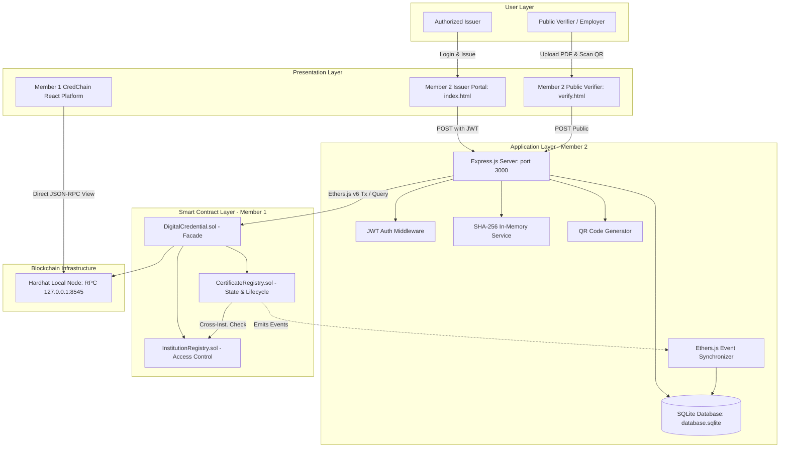
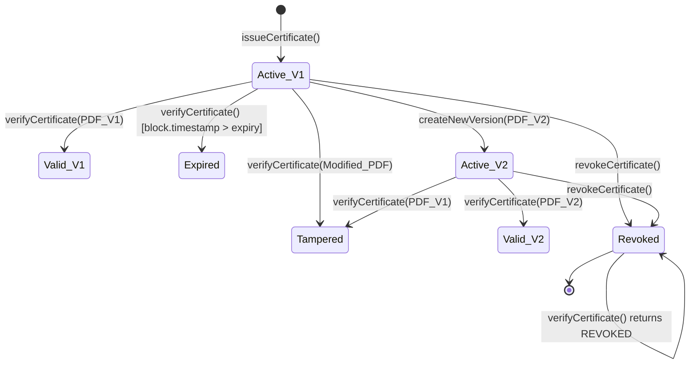

# CredChain
### Hybrid Blockchain-Backed Digital Credential Verification & Lifecycle Management System


**CredChain** is a hybrid blockchain-backed digital credential verification and lifecycle management system. It combines the cryptographic immutability of Ethereum smart contracts with an Express.js application layer and an off-chain SQLite store. By processing certificate PDF documents in memory to compute deterministic SHA-256 digests, CredChain establishes tamper-evident cryptographic proofs on-chain while keeping student Personally Identifiable Information (PII) private and off-chain.

---

## Table of Contents
1. [Overview](#1-overview)
2. [Problem Statement](#2-problem-statement)
3. [Proposed Solution](#3-proposed-solution)
4. [Key Features](#4-key-features)
5. [How the System Works](#5-how-the-system-works)
6. [System Architecture](#6-system-architecture)
7. [Smart Contract Architecture](#7-smart-contract-architecture)
8. [Data Architecture](#8-data-architecture)
9. [Certificate Lifecycle](#9-certificate-lifecycle)
10. [Verification Architecture](#10-verification-architecture)
11. [QR Code Verification](#11-qr-code-verification)
12. [Security Architecture](#12-security-architecture)
13. [Authentication & Authorization](#13-authentication--authorization)
14. [REST API Reference](#14-rest-api-reference)
15. [Database Architecture](#15-database-architecture)
16. [Repository Structure](#16-repository-structure)
17. [Member Responsibilities](#17-member-responsibilities)
18. [Technology Stack](#18-technology-stack)
19. [Installation & Setup](#19-installation--setup)
20. [Environment Variables](#20-environment-variables)
21. [Testing & Validation](#21-testing--validation)
22. [Security Testing](#22-security-testing)
23. [Step-by-Step Demo Flow](#23-step-by-step-demo-flow)
24. [Current Limitations (v1.0.0)](#24-current-limitations-v100)
25. [Future Scope](#25-future-scope)
26. [Technical Design Decisions (Viva Preparation)](#26-technical-design-decisions-viva-preparation)
27. [Project Results](#27-project-results)
28. [Blockchain Guarantees vs Non-Guarantees](#28-blockchain-guarantees-vs-non-guarantees)
29. [License](#29-license)
30. [Authors & Project Team](#30-authors--project-team)
31. [Related Documentation](#31-related-documentation)

---

## 1. Overview

Credential verification in academic and corporate environments is plagued by widespread document forgery, slow manual background checks, and fragile centralized databases. 

CredChain introduces a **hybrid blockchain architecture**:
- **On-Chain (Blockchain Trust Anchor):** Stores only cryptographic SHA-256 hashes, institution identifiers, issuer addresses, timestamp metadata, version sequences, and revocation flags. **Raw certificate files are never stored on the blockchain.**
- **Off-Chain (Application & Privacy Layer):** Handles in-memory PDF parsing, student metadata storage, JWT-authenticated institution workflows, zero-auth public verifier interfaces, QR code generation, and verification audit logging.

```text
┌─────────────────────────────────────────────────────────────────────────┐
│                           HYBRID DATA MODEL                             │
│                                                                         │
│   ON-CHAIN (Ethereum / EVM)          OFF-CHAIN (SQLite / Express)       │
│   ┌───────────────────────────┐      ┌──────────────────────────────┐   │
│   │ • SHA-256 Document Hash   │      │ • Student Full Name (PII)    │   │
│   │ • Unique Certificate ID   │      │ • Course / Qualification     │   │
│   │ • Issuer Wallet Address   │      │ • Issue Date                 │   │
│   │ • Institution ID Binding  │      │ • Verification Audit Logs    │   │
│   │ • Version History Tree    │      │   (Timestamp, IP, Result)    │   │
│   │ • Revocation State        │      │ • Transient PDF Buffer (RAM) │   │
│   └───────────────────────────┘      └──────────────────────────────┘   │
└─────────────────────────────────────────────────────────────────────────┘
```

---

## 2. Problem Statement

1. **Certificate Forgery & Tampering:** Digital PDFs can be effortlessly edited using desktop graphic tools. Modifying a student's name, grade, or degree title is undetectable to visual inspection alone.
2. **Centralized Database Vulnerabilities:** Traditional verification portals store credentials in centralized relational databases susceptible to SQL injection, administrative tampering, unauthorized modifications, and server outages.
3. **Cross-Institutional Insecurity:** In multi-tenant academic portals, lack of strict cryptographic ownership checks can allow unauthorized institutions to revoke or alter records belonging to other universities.
4. **Historical Version Ambiguity:** When an academic transcript or degree is legitimately updated (e.g. grade revisions or name corrections), centralized databases often overwrite past records without maintaining a verifiable on-chain audit trail.
5. **Slow and Friction-Heavy Verification:** Background verification often requires verifiers to register accounts, pay subscription fees, or install cryptocurrency wallet browser extensions.

---

## 3. Proposed Solution

CredChain implements an end-to-end credential lifecycle:

```text
[ Issuer Login ] ➔ [ Upload Certificate PDF ] ➔ [ Compute In-Memory SHA-256 ]
        │
        ▼
[ Record On-Chain Hash via Smart Contract ] ➔ [ Store Student Metadata in SQLite ]
        │
        ▼
[ Generate Zero-PII QR Code ] ➔ [ Distribute PDF & QR to Student ]
        │
        ▼
[ Public Verifier Scans QR / Uploads PDF ] ➔ [ Compute Hash & Query Smart Contract ]
        │
        ▼
[ Return Deterministic Status: VALID | TAMPERED | REVOKED | EXPIRED | NOT_FOUND ]
        │
        ▼
[ Record Client IP & Result in Off-Chain Audit Log ]
```

---

## 4. Key Features

### 4.1 Blockchain Core (Member 1)
- **Institution Registry (`InstitutionRegistry.sol`):** Platform-level registration, authority wallet binding, and deactivation of accredited institutions.
- **Role-Based Issuer Whitelisting:** Institution authority wallets dynamically authorize or revoke designated issuer wallet addresses.
- **Cryptographic Certificate Issuance (`CertificateRegistry.sol`):** Records certificate ID, SHA-256 hash digest, issuer wallet address, issuance timestamp, expiration timestamp, and institution ID.
- **Cryptographic Verification:** Gas-free `view` function comparing document hashes against on-chain records.
- **On-Chain Versioning:** Incremental version counters with historical version snapshot mappings (`certificateVersions[id][version]`).
- **Cryptographic Revocation:** Permanent state invalidation with `CertificateRevoked` event emission.
- **Cross-Institution Security:** Strict validation enforcing that only the issuing institution's authorized wallets can modify or revoke a certificate.
- **Facade Architecture (`DigitalCredential.sol`):** A unified facade simplifying multi-contract interactions.

### 4.2 Application & Integration (Member 2)
- **JWT Authentication:** Secure issuer authentication guarding mutating API routes (`/api/certificates/issue`, `/revoke`, `/version`, `/audit`).
- **In-Memory Hashing (`hashService.js`):** High-speed SHA-256 hashing directly from Node.js `Buffer` in RAM without writing temporary PDFs to disk.
- **Public Verification Engine:** Zero-auth public verification endpoint (`POST /api/certificates/verify`) accessible to employers, background check agencies, and universities without crypto wallets.
- **QR Code Generator:** Base64 Data URL QR generation encoding the public verification URL.
- **Real-Time Event Synchronizer (`eventListener.js`):** Background Ethers.js event listener that captures on-chain events and automatically synchronizes SQLite records.
- **Off-Chain Audit Logging:** Tracks verification attempts with timestamps, client IP addresses, user-agents, and verification outcomes.

### 4.3 Deterministic Verification Outcomes
| Status | Meaning |
| :--- | :--- |
| **`VALID`** | Certificate ID exists, document SHA-256 hash exactly matches the active on-chain hash, status is active, and expiration timestamp has not passed. |
| **`TAMPERED`** | Certificate ID exists on-chain, but the uploaded PDF produces a SHA-256 hash that does not match the registered hash. |
| **`REVOKED`** | Certificate ID exists, but the issuing institution has explicitly revoked the credential. |
| **`EXPIRED`** | Certificate ID exists, but the current block timestamp exceeds the registered expiration timestamp. |
| **`NOT_FOUND`** | Certificate ID does not exist in the smart contract registry. |

---

## 5. How the System Works

### 5.1 Certificate Issuance Workflow
1. An authorized institution issuer logs in to the Issuer Portal (`/index.html`) using their credentials, receiving a signed JWT.
2. The issuer fills in the certificate metadata (`studentName`, `courseName`, `certificateId`, `institutionId`) and uploads the candidate PDF document.
3. The Express backend receives the multipart form data using Multer in memory (`req.file.buffer`).
4. `hashService.js` computes the SHA-256 hash as a `0x`-prefixed 64-character hex string.
5. The backend dispatches a transaction to `DigitalCredential.issueCertificate(institutionId, certificateId, hash, expiryTimestamp)`.
6. The smart contract validates that the caller is an authorized issuer for `institutionId` and writes the record to on-chain storage.
7. The backend writes student metadata to the SQLite `certificates` table.
8. A verification QR code encoding `http://<host>/verify.html?id=<certificateId>` is generated and returned to the issuer.

### 5.2 Public Verification Workflow
1. A verifier navigates to `/verify.html` (or scans the certificate QR code, which auto-fills the `certificateId`).
2. The verifier uploads the certificate PDF document and clicks **Verify Certificate**.
3. The backend hashes the uploaded PDF buffer using SHA-256.
4. The backend calls `DigitalCredential.verifyCertificate(certificateId, hash)` via JSON-RPC.
5. The smart contract evaluates existence, hash matching, revocation status, and expiration, returning the deterministic status string.
6. The backend logs the client IP, timestamp, user-agent, and status outcome in `verification_logs`.
7. The frontend renders a color-coded status badge with certificate version and metadata.

---

## 6. System Architecture



---

## 7. Smart Contract Architecture

### 7.1 `InstitutionRegistry.sol`
- **Responsibilities:**
  - Manages accredited institutions (`id`, `name`, `wallet`, `isActive`, `exists`).
  - Platform administrator (deployer) registers and deactivates institutions via OpenZeppelin `Ownable`.
  - Institution authority wallets authorize and revoke operational issuer addresses (`authorizedIssuers[instId][issuerAddr]`).
  - Exposes `isAuthorizedIssuer(string instId, address issuer)` for access validation.

### 7.2 `CertificateRegistry.sol`
- **Responsibilities:**
  - Stores on-chain certificate state in `struct Certificate`.
  - Enforces `onlyFacade` modifier so that state changes occur only via `DigitalCredential.sol`.
  - Implements multi-status verification logic (`verifyCertificate`).
  - Manages historical version snapshots in `certificateVersions[id][version]`.
  - Implements strict cross-institution checks during revocation and version updates.

### 7.3 `DigitalCredential.sol`
- **Responsibilities:**
  - Acts as a unified entry point and facade for external callers.
  - Coordinates between `InstitutionRegistry` and `CertificateRegistry`.
  - Exposes clean interfaces for issuance, verification, revocation, and version queries.

---

## 8. Data Architecture

```text
┌──────────────────────────────────────┐     ┌──────────────────────────────────────┐
│           ON-CHAIN DATA              │     │           OFF-CHAIN DATA             │
│        (Ethereum Blockchain)         │     │         (SQLite Database)            │
├──────────────────────────────────────┤     ├──────────────────────────────────────┤
│ • certificateId (string)             │     │ • id (TEXT PRIMARY KEY)              │
│ • certificateHash (string: 0x...)    │     │ • studentName (TEXT)                 │
│ • issuer (address)                   │     │ • courseName (TEXT)                  │
│ • issueTimestamp (uint256)           │     │ • issueDate (TEXT: ISO8601)          │
│ • expiryTimestamp (uint256)          │     │ • institutionId (TEXT)               │
│ • status (enum: ACTIVE, REVOKED)     │     │ • status (TEXT: VALID, REVOKED)      │
│ • version (uint256)                  │     │ • verification_logs (Table):         │
│ • institutionId (string)             │     │   - id, certificateId, timestamp     │
│ • exists (bool)                      │     │   - status, ipAddress, userAgent     │
│ • certificateVersions (mapping)      │     │                                      │
└──────────────────────────────────────┘     └──────────────────────────────────────┘
```

### Why Raw PDFs Are Not Stored On-Chain
1. **Storage Prohibitions:** A single 1 MB PDF costs immense gas on public networks and exceeds EVM storage design guidelines.
2. **Mathematical Equivalence:** A 256-bit SHA-256 hash is collision-resistant and cryptographically proves whether a file is identical to the issued document.
3. **Data Privacy (GDPR/FERPA):** Storing raw PDFs exposes immutable student grades and personal information publicly. Hashing ensures privacy.

---

## 9. Certificate Lifecycle



---

## 10. Verification Architecture

The smart contract evaluates certificate validity in the following deterministic sequence:

```solidity
function verifyCertificate(string memory _certificateId, string memory _certificateHash) external view returns (string memory) {
    if (!certificates[_certificateId].exists) return "NOT_FOUND";
    
    Certificate memory cert = certificates[_certificateId];
    
    if (keccak256(bytes(cert.certificateHash)) != keccak256(bytes(_certificateHash))) return "TAMPERED";
    if (cert.status == CertificateStatus.REVOKED) return "REVOKED";
    if (cert.expiryTimestamp > 0 && block.timestamp > cert.expiryTimestamp) return "EXPIRED";
    
    return "VALID";
}
```

---

## 11. QR Code Verification

- **QR Payload Format:** `http://<host>:<port>/verify.html?id=<certificateId>`
- **Privacy Guarantees:**
  - Zero PII (no names, marks, or degree details).
  - Zero JWTs, private keys, or secret tokens.
  - Zero raw PDF binaries.
- **Verification Interaction:** When scanned, the verifier's browser opens the Public Verifier portal with the certificate ID pre-filled. The verifier then uploads the physical/digital PDF document to execute cryptographic verification.

---

## 12. Security Architecture

### 12.1 Cross-Institution Defense (The Institution ID Binding)
- **Vulnerability Prevented:** In a multi-tenant blockchain, an authorized issuer of *University B* might attempt to call `revokeCertificate` or `createNewVersion` on a certificate belonging to *University A*.
- **Implementation:** In `CertificateRegistry.sol`, both `revokeCertificate` and `createNewVersion` explicitly check:
  ```solidity
  if (keccak256(bytes(certificates[_certificateId].institutionId)) != keccak256(bytes(_institutionId))) revert UnauthorizedIssuer();
  ```
- **Result:** Even with valid signatures, an issuer from another institution is immediately reverted.

### 12.2 Additional Security Controls
- **`onlyFacade` Isolation:** Direct writes to `CertificateRegistry` from unauthorized addresses revert.
- **OpenZeppelin `Ownable`:** Restricts platform-level institution registry management to the administrator.
- **Anti-Duplication:** `issueCertificate` reverts with `CertificateAlreadyExists()` if the ID is already registered.
- **Anti-Double-Revocation:** `revokeCertificate` reverts with `CertificateAlreadyRevoked()`.
- **In-Memory Buffering:** Multer processes file uploads in RAM (`storage: multer.memoryStorage()`); raw files are never persisted on the server disk.

---

## 13. Authentication & Authorization

| Category | Authentication Layer (Member 2) | Blockchain Authorization (Member 1) | Public Verifier Access |
| :--- | :--- | :--- | :--- |
| **Technology** | JSON Web Token (JWT) | Ethereum ECDSA Wallet Signatures | None (Anonymous Open Access) |
| **Validation Point** | Express `authMiddleware.js` | Smart Contract `isAuthorizedIssuer()` | Open HTTP Route |
| **Token Validity** | 24 Hours (`expiresIn: '24h'`) | Per-Transaction Nonce/Signature | Instant Request |
| **Target Operations** | `issue`, `revoke`, `version`, `audit` | On-chain state mutations | `verify`, `getCertificateInfo` |

---

## 14. REST API Reference

| Method | Endpoint | Auth Required | Request Payload | Response Output |
| :--- | :--- | :---: | :--- | :--- |
| `POST` | `/api/auth/login` | **No** | JSON: `{ "username": "...", "password": "...", "institutionId": "..." }` | `{ "message": "...", "token": "...", "expiresIn": "24h", "user": {...} }` |
| `POST` | `/api/certificates/issue` | **YES (JWT)** | Multipart: `institutionId`, `certificateId`, `studentName`, `courseName`, `pdf` (file), `expiryTimestamp` | `{ "message": "...", "certificateId": "...", "hash": "...", "qrCode": "...", "verifyUrl": "..." }` |
| `POST` | `/api/certificates/verify` | **No** | Multipart: `certificateId`, `pdf` (file) | `{ "certificateId": "...", "status": "VALID\|TAMPERED\|REVOKED\|EXPIRED\|NOT_FOUND", "version": 1 }` |
| `POST` | `/api/certificates/revoke` | **YES (JWT)** | JSON: `{ "institutionId": "...", "certificateId": "..." }` | `{ "message": "Certificate revoked successfully", "certificateId": "..." }` |
| `POST` | `/api/certificates/version` | **YES (JWT)** | Multipart: `institutionId`, `certificateId`, `pdf` (file), `newExpiryTimestamp` | `{ "message": "Certificate version created successfully", "certificateId": "...", "newHash": "...", "version": 2 }` |
| `GET` | `/api/certificates/:id` | **No** | URL Parameter: `id` | `{ "id": "...", "studentName": "...", "courseName": "...", "issueDate": "...", "status": "..." }` |
| `GET` | `/api/certificates/:id/audit` | **YES (JWT)** | URL Parameter: `id` | `{ "count": N, "logs": [ { "id": 1, "certificateId": "...", "timestamp": "...", "status": "...", "ipAddress": "...", "userAgent": "..." } ] }` |
| `GET` | `/api/certificates/audit/all` | **YES (JWT)** | None | `{ "count": N, "logs": [...] }` |

---

## 15. Database Architecture

SQLite schema (`database.sqlite`):

```sql
-- Certificate metadata table
CREATE TABLE IF NOT EXISTS certificates (
    id TEXT PRIMARY KEY,
    studentName TEXT,
    courseName TEXT,
    issueDate TEXT,
    institutionId TEXT,
    status TEXT
);

-- Public verification telemetry log table
CREATE TABLE IF NOT EXISTS verification_logs (
    id INTEGER PRIMARY KEY AUTOINCREMENT,
    certificateId TEXT,
    timestamp TEXT,
    status TEXT,
    ipAddress TEXT,
    userAgent TEXT
);
```

---

## 16. Repository Structure

```text
Certificate-Verification-System/
├── .gitignore                                      # Root Git ignore rules
├── README.md                                       # Complete Project Documentation (v1.0.0)
│
├── member-1-blockchain-core/                       # Member 1: Smart Contracts & Trust Layer
│   ├── contracts/
│   │   ├── InstitutionRegistry.sol                 # Institution & issuer authority registry
│   │   ├── CertificateRegistry.sol                 # Certificate hashes, lifecycle & versioning
│   │   └── DigitalCredential.sol                   # Unified integration facade contract
│   ├── scripts/
│   │   ├── deploy.js                               # Hardhat contract deployment script
│   │   └── setupDemo.js                            # Demo institution/issuer setup script
│   ├── test/
│   │   ├── Authorization.test.js                   # Issuer authorization tests
│   │   ├── CertificateRegistry.test.js             # Issuance & hash verification tests
│   │   ├── CrossInstitutionSecurity.test.js        # Cross-institution attack regression tests
│   │   ├── Expiration.test.js                      # Certificate expiration tests
│   │   ├── InstitutionRegistry.test.js             # Institution registration tests
│   │   ├── Revocation.test.js                      # Revocation lifecycle tests
│   │   └── Versioning.test.js                      # Version history tests
│   ├── hardhat.config.js                           # Hardhat EVM compiler configuration
│   ├── package.json                                # Hardhat & OpenZeppelin dependencies
│   ├── README.md                                   # Member 1 Core technical guide
│   └── frontend/                                   # Member 1: CredChain React Platform
│       ├── src/
│       │   ├── App.jsx, main.jsx, App.css          # React application root
│       │   ├── pages/ (11 pages)                   # Dashboard, Verification, Analytics, etc.
│       │   ├── components/                         # WalletConnect, Layout, UI Components
│       │   ├── services/blockchain.js              # Direct frontend Ethers.js integration
│       │   └── contracts/                          # Contract ABIs
│       ├── index.html                              # React HTML entry
│       ├── package.json                            # React 18 & Vite dependencies
│       └── vite.config.js                          # Vite build tool configuration
│
└── member-2-blockchain-application/                # Member 2: Backend & Public Application Layer
    ├── src/
    │   ├── config/
    │   │   ├── blockchain.js                       # Ethers.js v6 contract connectors
    │   │   └── database.js                         # SQLite connection & table initialization
    │   ├── controllers/
    │   │   ├── authController.js                   # JWT login and token generation
    │   │   └── certificateController.js            # Issuance, verification, revoke & audit
    │   ├── middleware/
    │   │   └── authMiddleware.js                   # JWT header validation guard
    │   ├── routes/
    │   │   ├── authRoutes.js                       # Authentication route definitions
    │   │   └── certificateRoutes.js                # Certificate & verification API routes
    │   └── services/
    │       ├── eventListener.js                    # Real-time blockchain event synchronizer
    │       └── hashService.js                      # In-memory SHA-256 computation service
    ├── public/
    │   ├── index.html                              # Issuer management portal (JWT authenticated)
    │   └── verify.html                             # Public verification portal (Zero auth)
    ├── server.js                                   # Express server bootstrap & port listener
    ├── package.json                                # Express, Ethers.js, Multer, SQLite dependencies
    └── README.md                                   # Member 2 Application technical guide
```

---

## 17. Member Responsibilities

### Member 1 — Blockchain Core & Trust Layer Engineer
- Designed and authored Solidity smart contracts (`InstitutionRegistry.sol`, `CertificateRegistry.sol`, `DigitalCredential.sol`).
- Configured the Hardhat local Ethereum node development environment.
- Implemented the facade pattern and `onlyFacade` access controls.
- Authored the comprehensive Hardhat unit and security regression test suite (31 tests).
- Engineered the cross-institution smart contract security boundary.
- Developed the Member 1 CredChain React 18 / Vite administrative platform.

### Member 2 — Blockchain Application & Verification Engineer
- Developed the Express.js REST application layer and API controllers.
- Integrated the backend with smart contracts using Ethers.js v6.
- Implemented the in-memory SHA-256 buffer hashing service (`hashService.js`).
- Designed the SQLite database schema (`certificates` and `verification_logs`).
- Implemented the real-time blockchain event synchronization service (`eventListener.js`).
- Engineered the JWT authentication flow and route protection middleware.
- Built the QR code generation engine and public verification portal (`verify.html`).
- Built the issuer management interface (`index.html`).

---

## 18. Technology Stack

| Layer | Technology | Version | Purpose |
| :--- | :--- | :--- | :--- |
| **Smart Contracts** | Solidity | `^0.8.20` | Core smart contract business logic |
| **Development Network** | Hardhat | `^2.22.0` | EVM compiler, testing runtime, and local RPC node |
| **Contract Security** | OpenZeppelin | `^5.0.0` | Standard `Ownable` contract library |
| **Blockchain Client** | Ethers.js | `v6.17.0` | JSON-RPC provider, contract bindings, wallet transactions |
| **Backend Runtime** | Node.js (ESM) | `v18+` | Server execution environment |
| **Web Framework** | Express.js | `^4.19.2` | RESTful API server |
| **File Processing** | Multer | `^1.4.5-lts.1`| In-memory multipart buffer extraction |
| **Database** | SQLite3 | `^5.1.7` | Off-chain certificate metadata and audit logging |
| **Authentication** | JSON Web Tokens | `^9.0.2` | Stateless HTTP authorization tokens |
| **QR Engine** | QRCode | `^1.5.3` | QR code Base64 Data URL generation |
| **Frontend 1 (Admin)** | React / Vite | `^19.2.8` / `^6.1.0` | Member 1 administrative dashboard |
| **Frontend 2 (Public)** | HTML5 / CSS3 / JS | Vanilla | Member 2 issuer and public verifier portals |
| **Cryptography** | Node `crypto` | Native | SHA-256 cryptographic document digest computation |
| **Testing** | Mocha / Chai | Native Hardhat | Automated contract test runners and assertions |

---

## 19. Installation & Setup

### 19.1 Prerequisites
- **Node.js** (v18.0.0 or higher recommended)
- **npm** (v9.0.0 or higher)
- **Git**

### 19.2 Step 1: Clone Repository
```bash
git clone https://github.com/aryankumarjha2006-oss/Certificate-Verification-System.git
cd Certificate-Verification-System
```

### 19.3 Step 2: Install Member 1 Dependencies
```bash
cd member-1-blockchain-core
npm install
```

### 19.4 Step 3: Start Hardhat Local Blockchain
In your first terminal:
```bash
cd member-1-blockchain-core
npx hardhat node
```
*Hardhat node will start at `http://127.0.0.1:8545` (Chain ID: 31337).*

### 19.5 Step 4: Deploy Smart Contracts
In a second terminal:
```bash
cd member-1-blockchain-core
npx hardhat run scripts/deploy.js --network localhost
```
*Take note of the deployed contract addresses. By default on a clean node, they deploy to:*
- `InstitutionRegistry`: `0x5FbDB2315678afecb367f032d93F642f64180aa3`
- `CertificateRegistry`: `0xe7f1725E7734CE288F8367e1Bb143E90bb3F0512`
- `DigitalCredential`: `0x9fE46736679d2D9a65F0992F2272dE9f3c7fa6e0`

*(Optional) Seed demo institution & issuer:*
```bash
npx hardhat run scripts/setupDemo.js --network localhost
```

### 19.6 Step 5: Install Member 2 Dependencies & Configure Environment
In a third terminal:
```bash
cd ../member-2-blockchain-application
npm install
```
Verify or create `member-2-blockchain-application/.env`:
```env
PORT=3000
RPC_URL=http://127.0.0.1:8545
PRIVATE_KEY=0xac0974bec39a17e36ba4a6b4d238ff944bacb478cbed5efcae784d7bf4f2ff80
INSTITUTION_REGISTRY_ADDRESS=0x5FbDB2315678afecb367f032d93F642f64180aa3
CERTIFICATE_REGISTRY_ADDRESS=0xe7f1725E7734CE288F8367e1Bb143E90bb3F0512
DIGITAL_CREDENTIAL_ADDRESS=0x9fE46736679d2D9a65F0992F2272dE9f3c7fa6e0
JWT_SECRET=supersecretjwtkey123
ISSUER_USERNAME=admin
ISSUER_PASSWORD=admin123
```

### 19.7 Step 6: Start Member 2 Backend Application
```bash
cd member-2-blockchain-application
node server.js
```
*The server will start on `http://localhost:3000` and automatically connect to Hardhat and SQLite.*

### 19.8 Step 7: (Optional) Run Member 1 React Frontend
```bash
cd ../member-1-blockchain-core/frontend
npm install
npm run dev
```

### 19.9 Step 8: Access the Application Portals
- **Member 2 Issuer Portal:** `http://localhost:3000/index.html`
- **Member 2 Public Verifier Portal:** `http://localhost:3000/verify.html`
- **Member 1 React Platform:** `http://localhost:5173/`

---

## 20. Environment Variables

| Variable | Description | Default (Local Dev) |
| :--- | :--- | :--- |
| `PORT` | Express server HTTP port | `3000` |
| `RPC_URL` | EVM JSON-RPC provider endpoint | `http://127.0.0.1:8545` |
| `PRIVATE_KEY` | Hardhat default Account #0 private key | `0xac0974bec39a17e36ba4a6b4d238ff944bacb478cbed5efcae784d7bf4f2ff80` |
| `INSTITUTION_REGISTRY_ADDRESS` | Deployed `InstitutionRegistry` address | `0x5FbDB2315678afecb367f032d93F642f64180aa3` |
| `CERTIFICATE_REGISTRY_ADDRESS` | Deployed `CertificateRegistry` address | `0xe7f1725E7734CE288F8367e1Bb143E90bb3F0512` |
| `DIGITAL_CREDENTIAL_ADDRESS` | Deployed `DigitalCredential` facade address | `0x9fE46736679d2D9a65F0992F2272dE9f3c7fa6e0` |
| `JWT_SECRET` | Secret key for signing and verifying JWTs | `supersecretjwtkey123` |
| `ISSUER_USERNAME` | Demo administrative issuer login username | `admin` |
| `ISSUER_PASSWORD` | Demo administrative issuer login password | `admin123` |

---

## 21. Testing & Validation

Run the full smart contract test suite from `member-1-blockchain-core`:

```bash
cd member-1-blockchain-core
npx hardhat test
```

### Confirmed Results: **31 Passing Tests (2s)**
- **`Authorization.test.js` (5 tests):** Issuer authorization, revocation, and inactive institution rejection.
- **`CertificateRegistry.test.js` (7 tests):** Issuance, duplicate rejection, tamper detection, and input validation.
- **`CrossInstitutionSecurity.test.js` (3 tests):** Unauthorized cross-institution revocation and versioning rejection.
- **`Expiration.test.js` (2 tests):** Valid non-expired vs expired certificates.
- **`InstitutionRegistry.test.js` (8 tests):** Registration, duplicate ID prevention, deactivation, and permissions.
- **`Revocation.test.js` (4 tests):** Revocation execution, authority overrides, and double-revocation guards.
- **`Versioning.test.js` (2 tests):** Monotonic version increments and unauthorized version creation rejection.

---

## 22. Security Testing

### Cross-Institution Attack Simulation (`CrossInstitutionSecurity.test.js`)
1. **Setup:** Institution A (`INST_A`) registers Issuer A. Institution B (`INST_B`) registers Issuer B.
2. **Action 1:** Issuer A issues certificate `CERT_INST_A_001` on-chain.
3. **Attack 1:** Issuer B attempts to revoke `CERT_INST_A_001` passing `INST_B`.
   - **Result:** Reverted with `UnauthorizedIssuer()`.
4. **Attack 2:** Issuer B attempts to create a new version of `CERT_INST_A_001` passing `INST_B`.
   - **Result:** Reverted with `UnauthorizedIssuer()`.
5. **Legitimate Action:** Issuer A revokes and versions their own certificate.
   - **Result:** Succeeds with event emission.

---

## 23. Step-by-Step Demo Flow

1. **Start Blockchain & Backend:** Launch `npx hardhat node` and `node server.js`.
2. **Open Issuer Portal:** Navigate to `http://localhost:3000/index.html`.
3. **Authenticate:** Log in with `admin` / `admin123`.
4. **Issue Certificate:** Enter ID `DEMO-CERT-101`, Student `John Doe`, Course `Computer Science`, attach candidate PDF, and click **Issue Certificate**.
5. **Inspect Output:** Note the returned SHA-256 hash and generated QR code.
6. **Public Verification (Genuine):** Navigate to `http://localhost:3000/verify.html`, enter `DEMO-CERT-101`, attach the genuine PDF, and verify ➔ Status returns **`VALID`**.
7. **Tamper Test:** Edit one character in the PDF using a text editor, re-upload ➔ Status returns **`TAMPERED`**.
8. **Unknown Certificate Test:** Enter an unissued ID `UNKNOWN-999` ➔ Status returns **`NOT_FOUND`**.
9. **Create Version 2:** In the Issuer Portal, submit `DEMO-CERT-101` with an updated PDF ➔ Version increments to **`2`**.
10. **Verify Version 2:** Verifying the updated PDF returns **`VALID` (Version 2)**; verifying the old PDF returns **`TAMPERED`**.
11. **Revocation:** In the Issuer Portal, submit `DEMO-CERT-101` for revocation ➔ Public verification immediately reflects **`REVOKED`**.
12. **Audit History:** Review the SQLite `verification_logs` table to confirm all verification attempts were logged.

---

## 24. Current Limitations (v1.0.0)

- **Local Network Execution:** Configured for local Hardhat node (`http://127.0.0.1:8545`).
- **No IPFS / Decentralized File Storage:** Raw PDFs are processed in memory and not stored on IPFS.
- **No W3C Verifiable Credentials / DID:** Uses Ethereum addresses and custom string IDs.
- **Single-Chain Architecture:** EVM-compatible without cross-chain bridges or Layer-2 rollups.
- **No Native Mobile App:** Implemented as a responsive web application.
- **No Automated Email / SMS Notifications:** Credentials are distributed manually or via QR code.

---

## 25. Future Scope

- **Decentralized Storage:** Optional integration with encrypted IPFS/Filecoin for verifiable PDF retrieval.
- **W3C DID Compliance:** Adoption of Decentralized Identifiers (DIDs) for international credential interoperability.
- **Public Layer-2 Deployment:** Migration to Arbitrum or Polygon for low-cost public production verification.
- **Zero-Knowledge Proofs (ZKP):** Enabling selective disclosure (e.g., proving graduation without exposing marks).
- **Mobile Credential Wallet:** Dedicated native iOS/Android mobile wallet application.

---

## 26. Technical Design Decisions (Viva Preparation)

1. **Why hash PDFs instead of storing PDFs on-chain?**  
   *Storing files on-chain is gas-prohibitive and violates privacy principles. A SHA-256 hash uniquely represents the document with zero storage bloat and zero PII leakage.*
2. **Why use SQLite?**  
   *Provides a lightweight, zero-configuration off-chain database for searching student names and recording verification audit logs without complex external database servers.*
3. **Why a hybrid architecture?**  
   *Combines the immutable trust of blockchain with the speed, searchability, and privacy of traditional relational storage.*
4. **Why does QR contain only a verification URL?**  
   *Prevents leaking student personal data or private keys in public QR scans. The verifier must present the actual document to verify authenticity.*
5. **Why does public verification not require a crypto wallet?**  
   *Eliminates friction for employers and verifiers. Calling `view` smart contract functions via a backend JSON-RPC provider is free and requires no gas.*
6. **Why use a facade contract (`DigitalCredential.sol`)?**  
   *Encapsulates multi-contract coordination into a single integration contract, providing a clean API for backend and frontend developers.*
7. **Why store `institutionId` inside the `Certificate` struct?**  
   *Guarantees cryptographic access boundaries on-chain, preventing cross-institution tampering even if an attacker possesses authorized issuer credentials from a different university.*
8. **Why use SHA-256?**  
   *Industry-standard cryptographic hash function supported natively in Node.js `crypto` and Solidity `sha256()`, providing 256-bit collision resistance.*

---

## 27. Project Results

- **Contract Tests:** 31 / 31 passing (Hardhat).
- **Security Validation:** Cross-institution unauthorized attacks reverted successfully.
- **Full Lifecycle Integration:** Issuance, SHA-256 hashing, QR generation, verification, versioning, revocation, and audit logging verified end-to-end.
- **Event Synchronization:** Real-time synchronization from blockchain events to SQLite database confirmed.
- **Code Quality:** Zero console errors, clean separation of concerns, and zero modified source files at freeze.

---

## 28. Blockchain Guarantees vs Non-Guarantees

### What the Blockchain DOES Guarantee:
- **Tamper Evidence:** Once a document hash is recorded, altering a single byte in the physical PDF makes it impossible to pass verification.
- **Immutability of History:** Issuance timestamps, version history, and revocation records cannot be rewritten or erased.
- **Cryptographic Access Control:** Only whitelisted issuer wallets can record or revoke certificates for their institution.

### What the Blockchain DOES NOT Guarantee:
- **Off-Chain Data Authenticity:** Blockchain proves document integrity from the point of issuance, but cannot verify whether the issuing institution entered accurate student information before signing.
- **Physical File Persistence:** The blockchain stores the cryptographic proof, not the PDF itself; if the student loses their PDF, the blockchain cannot reconstruct the file.

---

## 29. License

This project is licensed under the **MIT License**.

---

## 30. Authors & Project Team

- **Member 1 (Blockchain Core & Trust Layer):** Solidity Smart Contracts, Hardhat Environment, Security Architecture & Test Suite, CredChain React Platform.
- **Member 2 (Blockchain Application & Verification):** Express.js Backend, Ethers.js Integration, SHA-256 In-Memory Hashing, SQLite Database & Audit Logging, QR Code Engine, Public Verifier & Issuer Web Portals.

---

## 31. Related Documentation

- [Member 1 Core Technical Guide](member-1-blockchain-core/README.md)
- [Member 2 Application Technical Guide](member-2-blockchain-application/README.md)
- [Master Specification Document (v1.0.0)](file:///C:/Blockchain%20Project/Certificate-Verification-System/README.md)